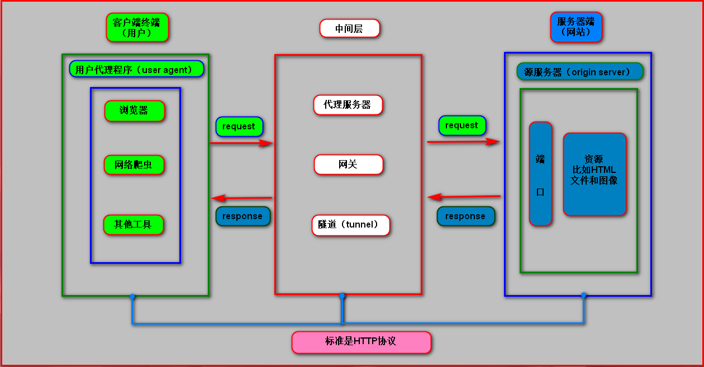
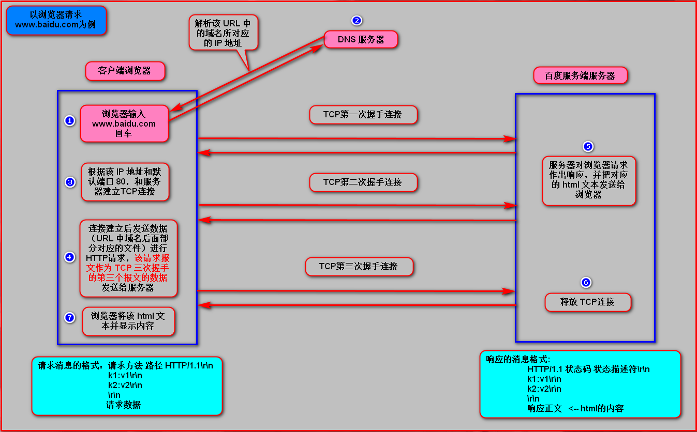

# http协议
超文本传输协议 ，默认端口80

# https协议
在http下加入ssl层，默认端口号是 443

# http图解

# http响应步骤（百度案例）
1. 客户端连接到Web服务器
一个HTTP客户端，通常是浏览器，与Web服务器的HTTP端口（默认为80）建立一个TCP套接字连接。例如，http://www.baidu.com。

2. 发送HTTP请求
通过TCP套接字，客户端向Web服务器发送一个文本的请求报文，一个请求报文由请求行、请求头部、空行和请求数据4部分组成。

3. 服务器接受请求并返回HTTP响应
Web服务器解析请求，定位请求资源。服务器将资源复本写到TCP套接字，由客户端读取。一个响应由状态行、响应头部、空行和响应数据4部分组成。

4. 释放连接TCP连接
若connection 模式为close，则服务器主动关闭TCP连接，客户端被动关闭连接，释放TCP连接;若connection 模式为keepalive，则该连接会保持一段时间，在该时间内可以继续接收请求;

5. 客户端浏览器解析HTML内容
客户端浏览器首先解析状态行，查看表明请求是否成功的状态代码。然后解析每一个响应头，响应头告知以下为若干字节的HTML文档和文档的字符集。客户端浏览器读取响应数据HTML，根据HTML的语法对其进行格式化，并在浏览器窗口中显示。
### 图解

# HTTP的请求方法
> HTTP/1.1协议中共定义了八种方法（也叫“动作”）来以不同方式操作指定的资源

### GET
向指定的资源发出“显示”请求。使用GET方法应该只用在读取数据，而不应当被用于产生“副作用”的操作中，例如在Web Application中。其中一个原因是GET可能会被网络蜘蛛等随意访问。

###HEAD
与GET方法一样，都是向服务器发出指定资源的请求。只不过服务器将不传回资源的本文部分。它的好处在于，使用这个方法可以在不必传输全部内容的情况下，就可以获取其中“关于该资源的信息”（元信息或称元数据）。

### POST
向指定资源提交数据，请求服务器进行处理（例如提交表单或者上传文件）。数据被包含在请求本文中。这个请求可能会创建新的资源或修改现有资源，或二者皆有。

### PUT
向指定资源位置上传其最新内容。

### DELETE
请求服务器删除Request-URI所标识的资源。

### TRACE
回显服务器收到的请求，主要用于测试或诊断。

### OPTIONS
这个方法可使服务器传回该资源所支持的所有HTTP请求方法。用'*'来代替资源名称，向Web服务器发送OPTIONS请求，可以测试服务器功能是否正常运作。

### CONNECT
HTTP/1.1协议中预留给能够将连接改为管道方式的代理服务器。通常用于SSL加密服务器的链接（经由非加密的HTTP代理服务器）。

>注意事项：

方法名称是区分大小写的。当某个请求所针对的资源不支持对应的请求方法的时候，服务器应当返回状态码405（Method Not Allowed），当服务器不认识或者不支持对应的请求方法的时候，应当返回状态码501（Not Implemented）。
HTTP服务器至少应该实现GET和HEAD方法，其他方法都是可选的。当然，所有的方法支持的实现都应当匹配下述的方法各自的语义定义。此外，除了上述方法，特定的HTTP服务器还能够扩展自定义的方法。例如PATCH（由 RFC 5789 指定的方法）用于将局部修改应用到资源。

# 请求头常见参数
1.`User-Agent`: 浏览器名称，这个在网络爬虫中经常会被使用到，请求网页的时候，服务器会通过这个参数知道你这个请求是哪种浏览器发出的，如果是通过爬虫发送的，那么我们的`User-Agent`就是`Python`,这对于那些有反爬虫机制的的网站来说，可以轻易的判断你这个请求是爬虫，因此我们常常会设置这个值来伪装我们的爬虫

2.`Referer`: 表明当前的这个请求是从哪个url过来的这个一般也可以用来做反爬虫技术，如果不是从指定页面过来的，那么就不做相关的响应

3.`Cookie`: http协议是状态的，只会链接一次就断开，也就是同一个人发送了两次请求，服务器没有能力判断这两个请求是来自同一个人，因此这个时候就用`cookie`来做标识，一般想要做登录后才能访问的网站就要使用`cookie`发送信息了

# HTTP状态码
所有HTTP响应的第一行都是状态行，依次是当前HTTP版本号，3位数字组成的状态代码，以及描述状态的短语，彼此由空格分隔。

状态代码的第一个数字代表当前响应的类型：

* 1xx消息——请求已被服务器接收，继续处理
* 2xx成功——请求已成功被服务器接收、理解、并接受
* 3xx重定向——需要后续操作才能完成这一请求
    * 301 : 永久重定向，比如在访问www.jingdong.com时就会重定向到www.jd.com
    * 302 : 临时重定向，比如在访问一个需要登录的页面的时候，而此时没有登录，那么就会重定向到登录界面
* 4xx请求错误——请求含有词法错误或者无法被执行
    * 400 : 请求的url在服务器上找不到，换句话说就是url错误
    * 403 : 服务器拒绝访问权限不够
* 5xx服务器错误——服务器在处理某个正确请求时发生错误，可能是服务器出bug了

>虽然 RFC 2616 中已经推荐了描述状态的短语，例如"200 OK"，"404 Not Found"，但是WEB开发者仍然能够自行决定采用何种短语，用以显示本地化的状态描述或者自定义信息。

# URL
>超文本传输协议（HTTP）的统一资源定位符将从因特网获取信息的五个基本元素包括在一个简单的地址中：

* scheme:传送协议,一般是http或者https或者ftp之类的
* 层级URL标记符号(为[//],固定不变)
* 访问资源需要的凭证信息（可省略）
* host：服务器。（通常为域名，有时为IP地址）
* port：端口号。（以数字方式表示，若为HTTP的默认值“:80”可省略）
* path：路径。（以“/”字符区别路径中的每一个目录名称）
* query-string：查询字符串。（GET模式的窗体参数，以“?”字符为起点，每个参数以“&”隔开，再以“=”分开参数名称与数据，通常以UTF8的URL编码，避开字符冲突的问题）
* anchor：锚点片段。以“#”字符为起点，前端用来做页面定位的

以http://www.baidu.com:80/news/index.html?id=250&page=1 为例, 其中：

* http，是协议；
* www.baidu.com，是服务器；
* 80，是服务器上的网络端口号；
* /news/index.html，是路径；
* ?id=250&page=1，是查询字符串。
>大多数网页浏览器不要求用户输入网页中“http://”的部分，因为绝大多数网页内容是超文本传输协议文件。同样，“80”是超文本传输协议文件的常用端口号，因此一般也不必写明。一般来说用户只要键入统一资源定位符的一部分（www.baidu.com:80/news/index.html?id=250&page=1）就可以了。
由于超文本传输协议允许服务器将浏览器重定向到另一个网页地址，因此许多服务器允许用户省略网页地址中的部分，比如 www。从技术上来说这样省略后的网页地址实际上是一个不同的网页地址，浏览器本身无法决定这个新地址是否通，服务器必须完成重定向的任务。
# HTTP请求格式

# HTTP响应格式
